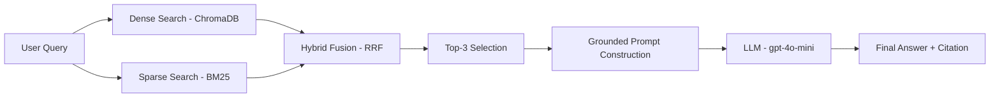
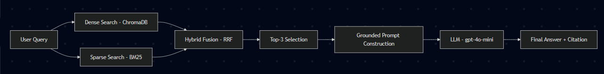

# Architecture — RAG Pipeline (Day 08 Lab)

> Template: Điền vào các mục này khi hoàn thành từng sprint.
> Deliverable của Documentation Owner.

## 1. Tổng quan kiến trúc

```
[Raw Docs]
    ↓
[index.py: Preprocess → Chunk → Embed → Store]
    ↓
[ChromaDB Vector Store]
    ↓
[rag_answer.py: Query → Retrieve → Rerank → Generate]
    ↓
[Grounded Answer + Citation]
```

**Mô tả ngắn gọn:**
> TODO: Mô tả hệ thống trong 2-3 câu. Nhóm xây gì? Cho ai dùng? Giải quyết vấn đề gì?
- Hệ thống là một trợ lý nội bộ thông minh phục vụ khối CS (Customer Service) và IT Helpdesk nhằm giải đáp các thắc mắc về chính sách hoàn tiền, quy trình cấp quyền và SLA xử lý sự cố. Hệ thống sử dụng kiến trúc RAG (Retrieval-Augmented Generation) để đảm bảo câu trả lời luôn được căn cứ (grounded) trên các tài liệu quy định thực tế của công ty, giảm thiểu tình trạng bịa đặt thông tin (hallucination).
---

## 2. Indexing Pipeline (Sprint 1)

### Tài liệu được index
| File | Nguồn | Department | Số chunk |
|------|-------|-----------|---------|
| `policy_refund_v4.txt` | policy/refund-v4.pdf | CS | ~3-5 |
| `sla_p1_2026.txt` | support/sla-p1-2026.pdf | IT | ~4-6 |
| `access_control_sop.txt` | it/access-control-sop.md | IT Security | ~5-7 |
| `it_helpdesk_faq.txt` | support/helpdesk-faq.md | IT | ~6-8 |
| `hr_leave_policy.txt` | hr/leave-policy-2026.pdf | HR | ~5-7 |

### Quyết định chunking
| Tham số | Giá trị | Lý do |
|---------|---------|-------|
| Chunk size | 400 tokens (~1600 ký tự) | Kích thước vừa đủ để bao quát một điều khoản hoặc một phân đoạn chính sách mà không làm loãng ngữ cảnh. |
| Overlap | 80 tokens (~320 ký tự) | Đảm bảo các thông tin quan trọng ở ranh giới giữa các chunk không bị mất mạch ý. |
| Chunking strategy | Heading-based | Ưu tiên cắt theo các tiêu đề mục === Section ... === để giữ tính toàn vẹn của nội dung theo logic tài liệu. |
| Metadata fields | source, section, effective_date, department, access | Hỗ trợ lọc tài liệu theo phiên bản (freshness), phân quyền truy cập và phục vụ việc trích dẫn (citation) chính xác. |

### Embedding model
- **Model**: OpenAI text-embedding-3-small
- **Vector store**: ChromaDB (PersistentClient)
- **Similarity metric**: Cosine Similarity

---

## 3. Retrieval Pipeline (Sprint 2 + 3)

### Baseline (Sprint 2)
| Tham số | Giá trị |
|---------|---------|
| Strategy | Dense (embedding similarity) |
| Top-k search | 10 |
| Top-k select | 3 |
| Rerank | Không |

### Variant (Sprint 3)
| Tham số | Giá trị | Thay đổi so với baseline |
|---------|---------|------------------------|
| Strategy | hybrid (Dense + BM25) | Kết hợp thêm tìm kiếm theo từ khóa (Sparse search). |
| Top-k search | 10 | Giữ nguyên để so sánh công bằng. |
| Top-k select | 3 | Giữ nguyên để duy trì "sweet spot" cho context. |
| Rerank | False | Không thay đổi gì |
| Query transform | False | Không thay đổi gì |

**Lý do chọn variant này:**
> TODO: Giải thích tại sao chọn biến này để tune.
> Ví dụ: "Chọn hybrid vì corpus có cả câu tự nhiên (policy) lẫn mã lỗi và tên chuyên ngành (SLA ticket P1, ERR-403)."
- Nhóm chọn Hybrid Retrieval vì bộ tài liệu nội bộ chứa nhiều thuật ngữ chuyên môn, mã lỗi (ERR-403, P1) và tên chính sách viết tắt. Dense search (Baseline) đôi khi bỏ lỡ các từ khóa chính xác này nếu chúng không xuất hiện thường xuyên trong tập dữ liệu huấn luyện của embedding model. Hybrid giúp đảm bảo bắt được cả ý nghĩa ngữ nghĩa lẫn các từ khóa quan trọng.

---

## 4. Generation (Sprint 2)

### Grounded Prompt Template
```
Answer only from the retrieved context below.
If the context is insufficient, say you do not know.
Cite the source field when possible.
Keep your answer short, clear, and factual.

Question: {query}

Context:
[1] {source} | {section} | score={score}
{chunk_text}

[2] ...

Answer:
```

### LLM Configuration
| Tham số | Giá trị |
|---------|---------|
| Model | gpt-4o-mini |
| Temperature | 0 (để output ổn định cho eval) |
| Max tokens | 512 |

---

## 5. Failure Mode Checklist

> Dùng khi debug — kiểm tra lần lượt: index → retrieval → generation

| Failure Mode | Triệu chứng | Cách kiểm tra |
|-------------|-------------|---------------|
| Index lỗi | Retrieve về docs cũ / sai version | `inspect_metadata_coverage()` trong index.py |
| Chunking tệ | Chunk cắt giữa điều khoản | `list_chunks()` và đọc text preview |
| Retrieval lỗi | Không tìm được expected source | `score_context_recall()` trong eval.py |
| Generation lỗi | Answer không grounded / bịa | `score_faithfulness()` trong eval.py |
| Token overload | Context quá dài → lost in the middle | Kiểm tra độ dài context_block |

---

## 6. Diagram (tùy chọn)

> TODO: Vẽ sơ đồ pipeline nếu có thời gian. Có thể dùng Mermaid hoặc drawio.




